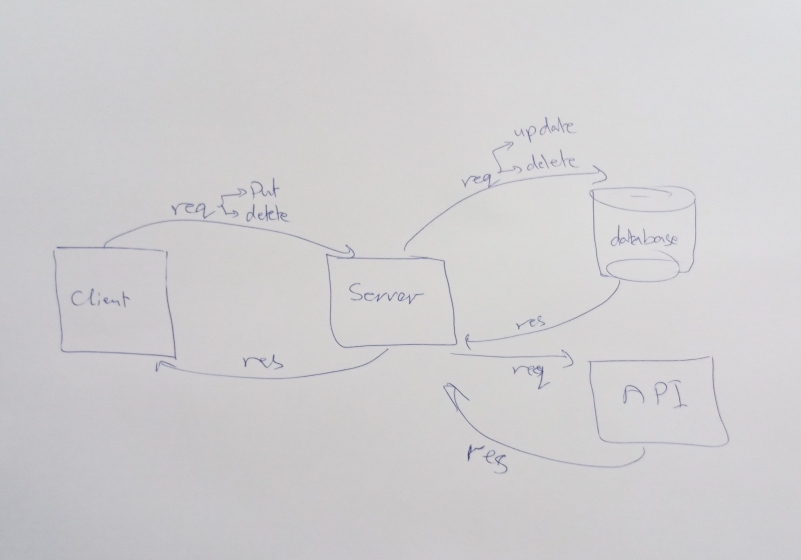

# Project Name - Movies-Library
**Author Name**: Asem Attallah

## WRRC

## Overview
This is the third project in back-end part in this course.Here I'm building a server by using express framework.And here I started to  make and deal with database.

## Getting Started
To build a server using express follow these steps:
1. **npm init -y** :yes.
2. create **index.js** file ,name is optional.
3. **npm install express** to install express package to use it.
4. **node index.js** to run the server.
5. **psql** to go inside your databases to start dealing.
6. **CREATE DATABASE databasename;** to create a new database.
7. inside **schema.sql** file write **CREATE TABLE table_name (
    column1 datatype,
    column2 datatype,
    column3 datatype,
   ....
);** to create a table.
8. (**psql  -d databasename -f schema.sql**) to connect my table with my database.
9. To be able to write qureis in my server:
- **npm install pg** and follow its steps to make it run.

## Project Features
1. '/' home page end-point => response : Movie(title, poster_path, overview).

2. '/favorite' Favorite page end-point => response:"Welcome to Favorite Page".

3. '/trending'end-point => response :Trending(id,title,release_date,poster_path,overview)

4. '/search'end-point => response : result of searching on movies

5. '/discover' end-point => response :Discover(title,release_date,overview)

6. '/genre' end-point => response :Genre(id,name)

7. '/addMovie' end-point => response : to add the data from the body to my database. 

8. '/getMovies' end-point => response : to get a specific data in my database.

9. /updateMovie/:id end-point => response :to make update on comment in my data

10. /delete/:id end-point => response : to delete a pecific data in my database.
    
    