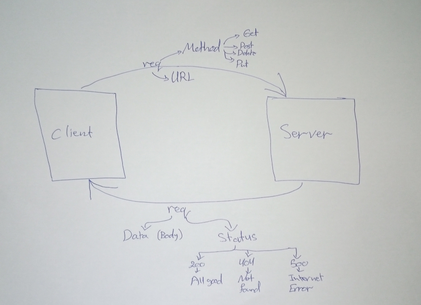

# Project Name - Movies-Library
**Author Name**: Asem Attallah

## WRRC

## Overview
This is the first project in back-end part in this course.Here I'm building a server by using express framework.

## Getting Started
To build a server using express follow these steps:
1. **npm init -y** :yes.
2. create **index.js** file ,name is optional.
3. **npm install express** to install express package to use it.
4. **node index.js** to run the server.

## Project Features
1. '/' home page end-point => response : Movie(title, poster_path, overview).
2. '/favorite' Favorite page end-point => response:"Welcome to Favorite Page".

    
    